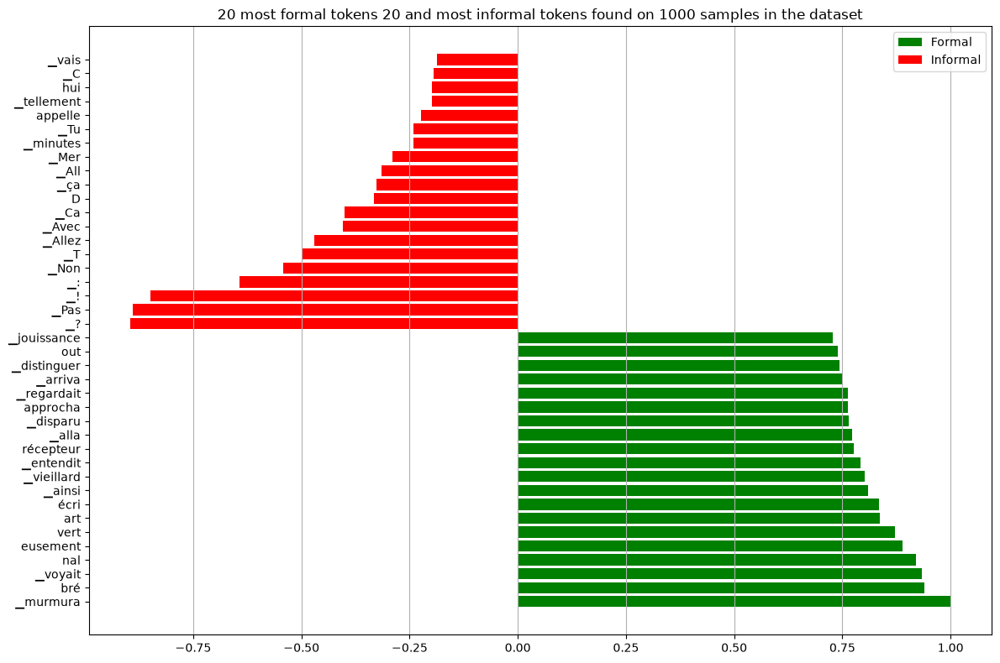
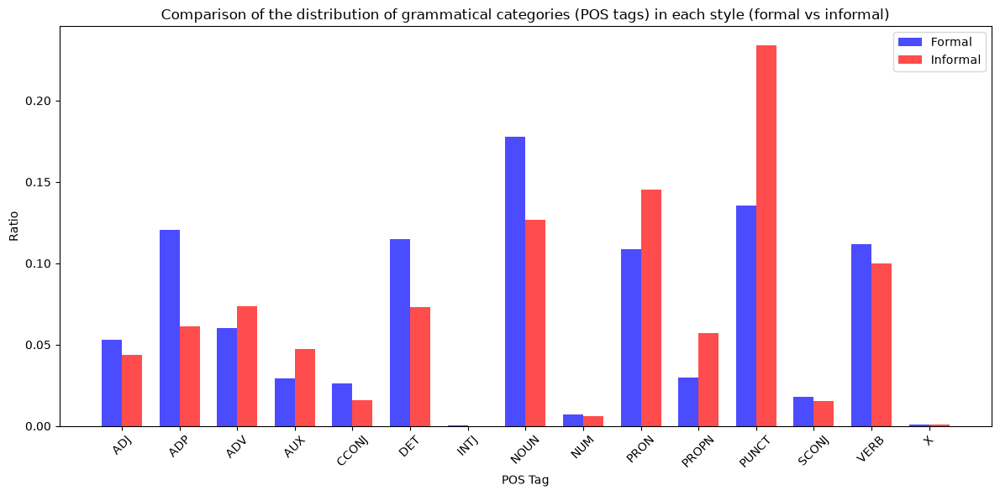
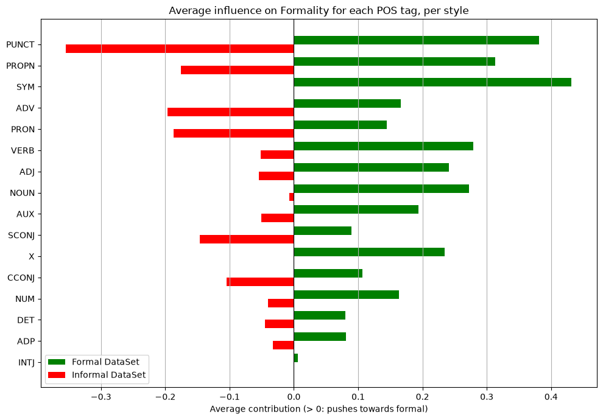

# French formality classifier: what does the model actually look at?

I fine-tuned **CamemBERT** to tell formal from informal French, then used **token masking** and **POS tags** to find out which cues it relies on. The model reaches 96% accuracy, but the analysis shows that it learned to separate **literary narration from spoken dialogue** as much as formal from informal language.

> **A small course project.** My goal was to practise what I learned in the NLP course I took during my exchange in Korea (regular expressions, NLTK, spaCy POS tagging, WordNet) on a question I found interesting, together with fine-tuning a transformer. It was never meant to be a production classifier, but a way to practise classical NLP with the limited compute I had.

## Setup

**Data.** Each sentence is labelled by its source: formal sentences come from five 19th-century novels, informal ones from film and TV subtitles (see `data/README.md`).

| Class | Source | Sentences |
|---|---|---|
| Formal | 5 French classics from Project Gutenberg: *Les Misérables*, *Le Comte de Monte-Cristo*, *Madame Bovary*, *Le Rouge et le Noir*, *Les Fleurs du mal* | 32,019 |
| Informal | French subtitles of 4 French films (*Intouchables*, *Les Bronzés font du ski*, *Les Tuche*, *Astérix & Obélix : L'Empire du Milieu*) and 1 TV episode (*Le Négociateur*). Copyrighted, so **not included** | 8,222 |

I cleaned the subtitles with regular expressions (timestamps, HTML tags, dialogue dashes), split both corpora into sentences with NLTK, and kept 20% of the sentences for validation (seed 42).

**Model and training.** I fine-tuned `camembert-base` with a two-class head, using cross-entropy, Adam (learning rate 1e-5), batches of 16 and a maximum length of 128 tokens. Because the project ran on free Colab compute, each of the 20 epochs trains on a new random sample of 500 training sentences.

**Interpretability.** To measure how much a token matters, I replace it with `<mask>` and record how much P(formal) drops. I then divide these drops by the largest one in the sentence, so the most important token gets a score of ±1 (positive means it pushes towards formal). Averaging the scores over 1,000 random sentences gives the most formal and most informal tokens, and grouping them by spaCy POS tag (`fr_core_news_sm`) shows which parts of speech the model relies on.

## Results

The model reaches **96.4% accuracy** on the full validation set (8,048 sentences, loss 0.107). Since there are four times more formal sentences, always answering "formal" would already give **79.6%**, so the model removes about 80% of the remaining errors.



The informal tokens are the register markers a linguist would expect: `?`, `!`, *Pas* (negation without *ne*), *Allez*, *Non*, *ça* and *Tu*. The formal tokens, on the other hand, are mostly narrative verbs in the *passé simple* and imperfect, such as *murmura, voyait, entendit, alla, approcha, regardait* and *arriva*. Since the passé simple is almost only used in written storytelling, these tokens signal "19th-century novel" more than formality.

**Parts of speech.** I looked at POS tags in two ways.

The first chart counts how often each tag appears in each class (3,000 sentences per class). Informal sentences contain far more punctuation and pronouns, while formal sentences contain more nouns, determiners and prepositions.



The second chart shows how much the model relies on each tag: each bar is the average masking score of the words with that tag, over 1,000 sentences of each class, i.e. how much P(formal) drops when such a word is masked, divided by the largest drop in its sentence.



Punctuation has one of the strongest effects on both sides (mostly `?` and `!` in informal text). In informal sentences the model also relies on adverbs, pronouns and proper nouns (often character names), while in formal sentences it relies on verbs, nouns and adjectives. This is consistent with the token list: narrative vocabulary on one side, spoken-language markers on the other.

## Limitations

- **Formality is confounded with era and genre.** The formal sentences are 19th-century literary narration and the informal ones are film and TV dialogue from 1979 to 2024. Since the top formal tokens are tense and narration markers, the 96% partly measures "novel vs. subtitle". A fair test would need both registers from the same period and medium, for example formal and casual emails.
- **Only one training run.** Training is seeded (seed 42), but it is not exactly reproducible on a GPU: two runs with the same seed on an Apple GPU gave 96.2% and 96.4%. Confident predictions stay the same, but borderline sentences can change. For example, *"Allons faire cela"* got P(formal) = 0.27 in the original 2025 run and 0.95 in this one.
- **Duplicate sentences.** Short lines like *"Oui!"* or *"Merci."* appear many times (about 6% of the sentences), so some identical sentences end up in both the training and validation sets.
- **Approximate masking scores.** Masking one subword at a time ignores interactions between words. When the model is very confident, masking a single word barely changes its prediction, even if several words together drive the decision.
- **Tagging errors.** spaCy's small French model sometimes mislabels words, and these errors carry over to the POS results.

I also tried to rewrite sentences into the other register by replacing words with WordNet synonyms, using the classifier as a guide. It did not work, because French WordNet has few synonyms and the classifier is unreliable on single words, so this code is not included.

## How to run

```bash
python -m venv .venv && source .venv/bin/activate
pip install -r requirements.txt      # includes the spaCy French model
# add the 5 subtitle files to data/subtitles/ (see data/README.md), then:
jupyter notebook formality_classifier.ipynb
```

The notebook runs top to bottom in about 18 minutes on an Apple M1 Max GPU, and uses CUDA, Apple MPS or the CPU depending on what is available. With other subtitle files, the numbers will differ slightly.

## Repository structure

```
formality_classifier.ipynb   data loading, fine-tuning, evaluation, token and POS analysis (with outputs)
data/books/                  formal corpus (public domain, Gutenberg license text removed)
data/subtitles/              informal corpus: add your own .srt files (not included)
figures/                     the three figures above, taken from the notebook outputs
requirements.txt             pinned dependencies
```

## Context

This was my individual final project for *CS372 Natural Language Processing with Python* (KAIST, Spring 2025). The topic, dataset construction, model and analysis are my own. In 2026 I cleaned and documented the notebook for publication with [Claude Code](https://claude.com/claude-code): I added relative paths and a fixed seed, fixed a word-alignment bug in the POS analysis and re-ran the notebook from scratch. The model and training procedure are unchanged.
